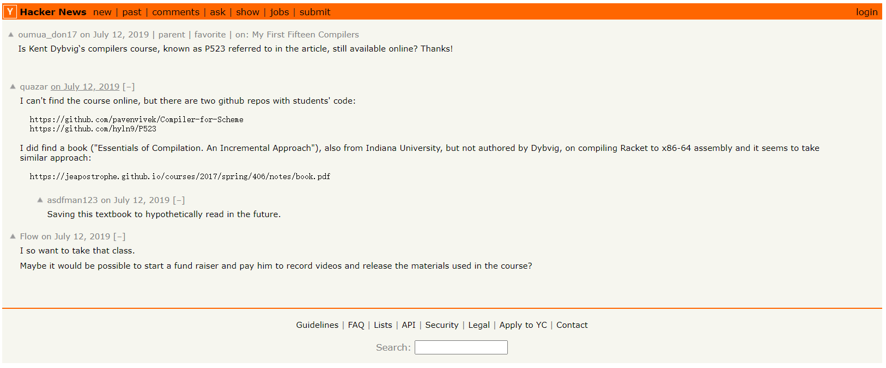

# P523-Rust
P523 经典编译器课程的 Rust 引导

P523 是一门经典的编译器课程，由 chez-scheme 的作者，R. Kent Dybvig 和他的助手教授。十年过去了，还有人想学习这门课程。

Kent 是谁？

> 如果你上了 Kent 的课，再来看看普通的编译器书籍（比如有名的 Dragon Book），或者 LLVM 的代码，你就会发现 Kent 的水平其实远在这些知名的大牛之上。我为什么可以这么说呢？因为如果你的水平不如这些人的话，你自己都会对这种判断产生怀疑。而如果你超过了别人，他们的一言一行，他们的每一个错误，都像是处于你的显微镜底下，看得一清二楚。这就是为什么有一天我拿起 Dragon Book，感觉它变得那么的幼稚。而其实并不是它变幼稚了，而是我变成熟了。实话实说吧，在编译器这个领域，我觉得 Kent 很有可能就是世界的 No.1。—— Chez Scheme 的传说

这里是基于 P523 的一个 Rust 作业框架及引导，供爱好者取用。为了提振信心，可以读一读王垠的 [Chez Scheme 的传说](http://www.yinwang.org/blog-cn/2013/03/28/chez-scheme)。

> Kent 的课程编译器有很好的结构，它被叫做“nanopass 编译器构架”。它的每一个 pass 只做很小的一件事情，然后这些 pass 被串联起来，形成一个完整的编译器。编译的过程，就是将输入程序经过一系列的变换之后，转化为机器代码。你也许发现了，这在本质上跟 LLVM 的构架是一样的。但是我可以告诉你，我们的课程编译器比 LLVM 干净利落许多，处于远远领先的地位。—— Chez Scheme 的传说

### 初心

见 [Rust-One-Piece](https://zhuanlan.zhihu.com/p/259594199) 初心部分。

以及[倔强的程序员](https://zhuanlan.zhihu.com/p/165524567)

### 准备

+ Rust Nightly
+ GCC

Rust 起码读了一遍 the book 。

### 通关流程

0. 阅读 Kent 的讲义
1. 看看 syntax 的变化
2. 看看 parser 的变化（可选）
3. 修改 compiler
4. 增减 test

### 至关重要的通关提示

关于你的
+ 每个关卡开始前，仔细读一读 P523 对应的 PDF，不然你会不知道我在说什么。
+ 进入新的关卡，第一件事是`cargo run`。
+ 学而不思则罔，思而不码则殆。
+ 每写完一个 pass，run 一下看看结果是否符合预期。

关于我的
+ 当我的引导与 P523 中有说的不同，而我又没有明确说明时，很可能是我错了，也许是我忘记了。请让我知道。
+ 将我的代码看成`90%`正确的，也许会是错的。
+ 当你参考我的代码实现时，有时候会遇到比较 naive 但能 work 的代码，通常我会说明。这些代码也必定会在后续的代码中被完善。

### week0

编译框架解释。

### week1

+ ParsePass
将字符串转换成语法树

+ CompileToAsmPass
将 Scheme 的表达式转换成 x86-64 的汇编格式

+ GenerateAsmPass
将汇编代码写到文件中

### week2

ExposeFrameVar 被融合进 CompileToAsm

Scanner 对每个 Token 增加了行与列的属性，并且跳过注释

Expr 新增 letrec, label, lambda, disp

Asm 新增 Deref

fv is not allowed in funcall

leaq

### week3

随着开发的推进，在 parser 和 scanner 有一些小的改进，散落在各个角落，但仍不影响原来的架构。

修改 syntax 以后，从 letrec 开始改起。新增 parse_locate

需要把所有的 special form 都写上，不然会有奇怪的 bug

如果遇到了 '('，有两种可能，一种是忘记 remove_top 将右边的括号删除，另一种是因为 special form 没覆盖导致的。

在 P523，parse 是平淡无奇的，但在这里，parse 是惊心动魄的。:D

+ expose-basic-blocks

这是我遇到的第一个有难度的 PASS。虽然分析出解法不容易，但代码的实现却异常的简单。

写代码前应该先想清楚。
观察输入的语法，发现

+ tail, effect, pred 当中都可以出现 if 和 begin，这两种语句是重点要处理的
+ 新的语法中，if 只能出现在 tail，故知，effect 和 pred 中的 if 要转换成 tail
+ tail 是处理入口，因此 tail_helper 先写，它应该返回一个 tail
+ pred_helper 需要生成 blocks 和跳转，因此，它的返回也是一个 tail，跳往新的 blocks
+ effects 只能出现在 begin 中，故知 effects_helper 需要返回一个 Begin。
+ effect_helper 注意，effect 并不能作为一个 block 的结尾，所以它需要传入一个 tail，它的返回也应该是一个 tail。

给自己预留点思考的时间吧！学而不思则罔。

+ optimize-jump

引入新的语义 If1 来表示单支 if 语句。为什么不直接编译到 Asm 中的 Jmpif 呢？理由是，我们希望减轻 CompileToAsm 的负担，这样，当我们想换一个后端，比如 Riscv 的时候，相对就好写一些。

从 P523 的 flatten-program 中剥离。

situation1:

(if (< rax 3) (l$1) (l$2))
(if (< rax 3) (l$1))
l$2 ...

对汇编代码进行拓扑排序，减少不必要的 jmp，理应能够提升性能。但现在先不考虑这么多的优化吧！

+ CompileToAsm
cmpq S2, S1 => S1 - S2

locate 可以不存在，A2 的 PASS 能够通过，较 P523 更宽松。

NOTE:

这一节，if-test 会在输出到文件的时候变成　if_test，因为 Gna Assembler 不允许 if-test 这样的标签。

这一节的　Jump 还有可优化的地方。比如一些没有必要的空 block。

且 cmpq 没有对常数进行检查。但更好的做法应该是进行 constant-folding

### week4

parse 过于简单，只是把 locate 转换成 locals，非常适合作为练习。到后面，也许 parse 会越来越简单，因为更多的语法变成了临时语法。

可以多设计一个 Funcall 带参数的，这样不影响原来的 Funcall，但是，我决定修改原来的 Funcall，使之带一个参数列表，并修改受影响的所有的代码。

register-assign

1. 取一个冲突最少的一个变量
2. 将之从冲突图中移除
3. 递归
4. 为刚刚所选的变量分配寄存器

discard-call-live

call-live 本身记录的调用的顺序，传递了那些需要用到的参数。看似无用，实为关键。

### week6

remove-complex-opera 与 flatten-set 合并更加符合直觉。

什么是 value？可能包含一些需要预先计算的表达式，就是 value。当有这些要计算的内容时，value 就要转换成 if 或者 begin 来包裹原来的表达式。

### Relax

士不可以不弘毅，任重而道远。仁以为己任，不亦重乎？死而后已，不亦远乎？

如果海洋注定要决堤，就让所有的苦水都注入我心中；如果陆地注定要上升，就让人类重新选择生存的峰顶。

愿我走过的苦难你不必经历，愿我已有的幸福你触手可及。

理想开花，桃李要结甜果；理想抽芽，榆杨会有浓荫。请乘理想之马，挥鞭从此启程，路上春色正好，天上太阳正晴。

艰难困苦，玉汝于成。
